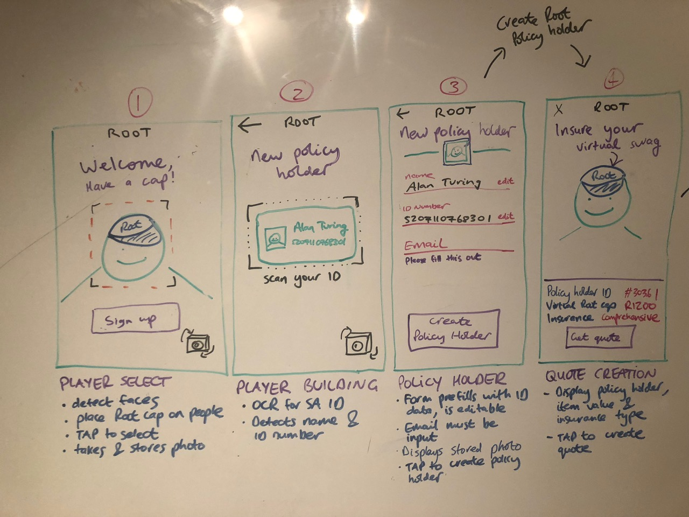
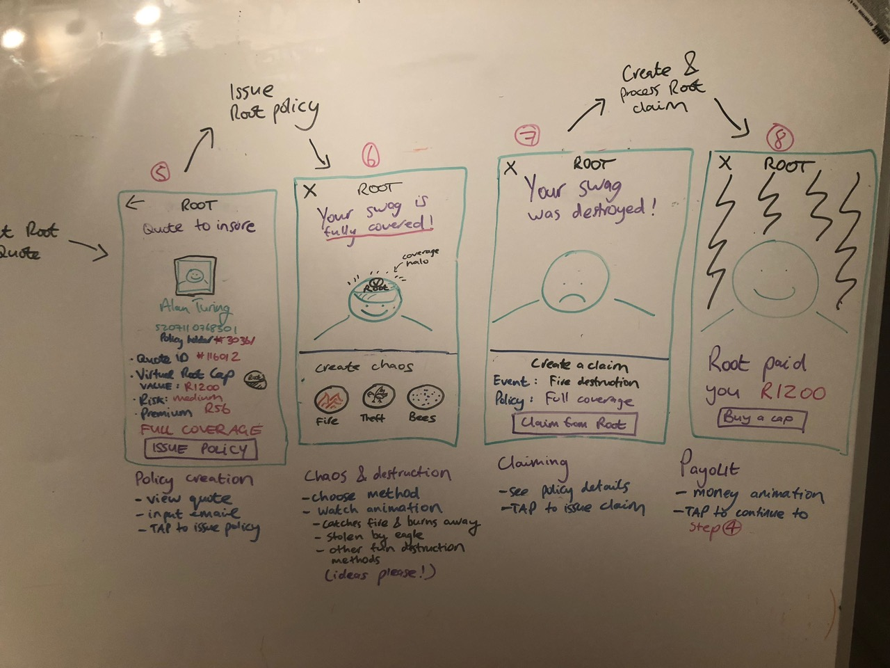

# Building ARInsuretech

Thanks for contributing to Make's new course - you're awesome 🌈 

# Course aims
_Help future makers, by:_

0. Figuring out sticky bits and compiling ProTips and helpful resources to reduce their friction
1. Explaining core concepts in AR and Insurance in simple terms
2. Providing code to reference and build upon
3. Coming up with inspiration for creative projects after they've nailed the fundamentals

It's important to note that Make's philosophy is *not to teach a fixed cirriculum*, but rather to enable makers to explore their own interests within the domain of AR and InsureTech. Pre-built activities will be provided as primers and starting points for makers to get familiar with concepts in order to be equipped to build their own ideas.

# Stack we're using
- Unity
- EasyAR
- Vuforia

# How to be an epic course builder
0. Communicate with the team as much as possible and keep notes - your experience and discoveries are super valuable!
1. Choose a particular component from the list of priorities that you'd like to figure out
2. Announce in #arinsuretech and tag the team e.g. "@course-builders I'm building object recognition in Unity" -> teaming up with others is a good idea
3. As you progress, dump any thoughts, struggles, realizatons, resources and code snippets in that thread. Just blab away, don't self-censor. All information is valuable.
4. If you're stuck, ping in Slack e.g. "@course-builders can somebody help me figure out world-space camera angles?" If somebody helps you past a blocker, make sure to capture what you learned. If you're properly blocked and have no path forward, move onto something else rather than struggling all day.
5. When you discover something cool, call Dan and the team over to see!
6. When you have a working prototype, create a folder `build/thing-name` in this repo and upload your code to it. Then announce your success to the team on Slack with a link to the folder!

# Things to build / figure out

## AR guides
_If you find a non-verbose online resource that answers any of these questions, that's ideal_
- Image targets
- Environment tracking
- 

## Learn Root flow in AR

This AR app will be available to makers to learn the Root Insurance flow, from quoting through to claiming, inside a fun AR context. The goal is to provide a working AR app with no Root API integration, and let them progressively integrate each step of the process. After fully integrating Root, they can then modify the AR components to their liking if they choose.

### High priority

- Prove a working method for interacting with Root API via Unity in JS
  - Directly in Unity, or
  - via a proxy e.g. ngrok
- Augment a virtual cap onto player's head (or other virtual swag if that's too complex)
- Build working forms for input in Unity, ideally situated in world space (rather than flat on the screen like web)

### Low priority
- Swag destruction animations
- Money payout animations
- ID card OCR to auto-fill forms

## B) Car insurance game

The aim of this app is to demonstrate the utility of insurance within an AR simulation, and enable makers to get familiar with creating controllable AR objects. Root integration will be stubbed out for now.

### High priority
- Driving virtual cars and damaging them in collisions (e.g. a race track, or when parking between pillars)

## C) Point-and-insure

This AR app is an upgrade of [Pineapple](http://pineapple.co.za), using live recognition rather than static photo analysis. The goal is to provide makers with guides and modules to classify insurable objects or people, highlight them in AR space, and overlay information or icons showing an item's insurance status.

### High priority
- Find a usable object classification library to detect either a) gadgets, b) household items, or c) people for life insurance
- Figure out how to highlight detected objects and place status icons in the environment

## Prep activities
These are small activities provided as a quick intro to initial concepts.

### Low priority
- ????? Unity sticking points
- Setting up a root organization, with success-state Slack webhooks

## Stretch goals
- Recognizing people from a set of many polaroids (for an augmented Maker wall)
- Creating an AR portal
